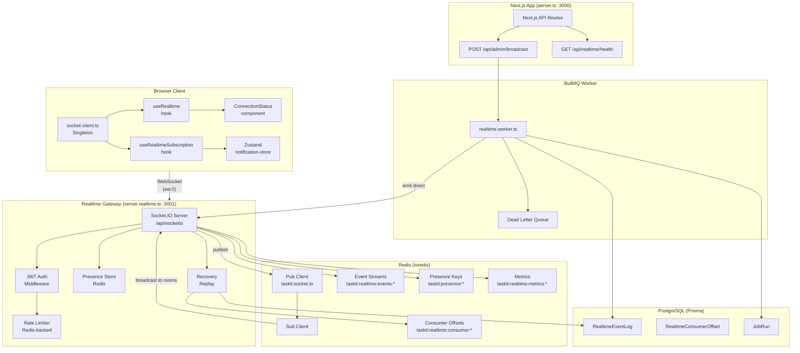

# Taskit Realtime Layer

Production-grade, zero-lag realtime system built on Socket.IO + Redis + BullMQ.

## Architecture



## Key Concepts

### Room Hierarchy

| Room key | Members |
|---|---|
| `company:<id>` | All authenticated users in the workspace |
| `user:<id>` | Single user (all their devices) |
| `company:<id>:channel:<channelId>` | Users subscribed to a specific channel |

### Event Lifecycle

```
Admin action
  → POST /api/admin/broadcast
  → enqueueRealtimeDelivery()          ← builds typed RealtimeEnvelope
  → BullMQ queue (idempotency key)
  → realtime.worker.ts
  → emitRealtimeEnvelopeDirect()
  → Socket.IO → Redis Pub/Sub → all instances → target room sockets
  → appendRealtimeEventLog()            ← Redis Stream + PostgreSQL
  → client socket.on('realtime:event')  ← ack → recordConsumerOffset
```

### Reconnect / Replay

1. Client stores `lastRealtimeEventId` in `localStorage`.
2. On `connect`, client emits `realtime:replay { afterEventId }`.
3. Server calls `loadMissedRealtimeEvents()` → Redis Stream → PostgreSQL fallback.
4. Server emits `realtime:replay [envelope[]]` back to socket.

### Offline Outgoing Buffer (`useRealtime`)

- Outgoing events are queued (max 100) when `socket.connected === false`.
- On `connect`, `flushOfflineQueue()` drains the queue in order.
- `optimistic(apply, rollback)` helper: apply state immediately, get back a rollback function.

## Files

| File | Purpose |
|---|---|
| `socket/socket-server.ts` | Socket.IO server: auth, rooms, presence, rate limiting |
| `adapters/redis.ts` | ioredis clients, Redis adapter, emitter singleton |
| `events/contracts.ts` | Zod schemas, `RealtimeEnvelope`, room helpers |
| `events/delivery.ts` | `enqueueRealtimeDelivery`, `emitRealtimeEnvelopeDirect` |
| `events/event-log.ts` | Redis Stream + PostgreSQL event log, consumer offsets |
| `events/delta.ts` | Shallow diff → `RealtimeEntityPatch` |
| `events/worker.ts` | BullMQ worker: process, retry, dead letter |
| `metrics/metrics.ts` | Redis metric counters, queue event listeners |
| `presence/presence-store.ts` | Online/offline tracking (Redis + local fallback) |
| `recovery/recovery.ts` | Missed event replay on reconnect |
| `realtime.integration.test.ts` | Unit + integration tests |
| `../../lib/realtime-event-payloads.ts` | Typed payload interfaces for all events |
| `../../lib/stores/notification-store.ts` | Zustand notification store |
| `../../hooks/useRealtime.ts` | React hook: status, emit, offline buffer, optimistic |
| `../../hooks/useRealtimeSubscription.ts` | Subscribe to typed realtime events |
| `../../components/realtime/ConnectionStatus.tsx` | Green/yellow/red dot indicator |
| `../../app/api/admin/broadcast/route.ts` | Admin broadcast API (all / department / user) |

## Environment Variables

```env
REALTIME_REDIS_URL=redis://localhost:6379        # Redis for Socket.IO adapter + presence
QUEUE_REDIS_URL=redis://localhost:6379           # Redis for BullMQ (can be same)
REALTIME_GATEWAY_PORT=3001                       # Port for standalone gateway
SOCKET_IO_PATH=/api/socketio                     # Socket.IO mount path
NEXT_PUBLIC_SOCKET_IO_URL=                       # Override Socket.IO URL (client)
NEXT_PUBLIC_SOCKET_IO_ENABLED=true               # Enable Socket.IO on client
SOCKET_IO_REDIS_KEY=taskit:socket.io             # Redis namespace key
REALTIME_HEARTBEAT_REFRESH_MS=30000              # Heartbeat interval
REALTIME_PRESENCE_TTL_SECONDS=45                 # Presence key TTL
REALTIME_STREAM_MAXLEN=10000                     # Redis stream max entries
REALTIME_DELIVERY_ATTEMPTS=5                     # BullMQ retry count
REALTIME_WORKER_CONCURRENCY=25                   # Worker concurrency
```

## Running Tests

```bash
tsx --test src/modules/realtime/realtime.integration.test.ts
```

## Performance Characteristics

- **Delivery path (direct, Redis available):** `enqueueRealtimeDelivery` → BullMQ → worker → emit ≈ 5–15ms
- **Delivery path (queue bypass, in-process):** `emitRealtimeEnvelopeDirect` ≈ <1ms
- **Envelope build + Zod parse:** <0.05ms per envelope (verified by integration test)
- **Reconnect replay:** Redis Stream (O(n) scan) → first 100 missed events
- **Presence snapshot:** O(active users) Redis hash reads, cached by TTL

## Scaling

- Each server instance is **stateless** — all state lives in Redis.
- `@socket.io/redis-adapter` propagates room broadcasts across all instances via Pub/Sub.
- `@socket.io/redis-emitter` lets any process (API routes, workers) broadcast without a live Socket.IO instance.
- BullMQ workers can be scaled independently (`npm run worker:realtime`).
